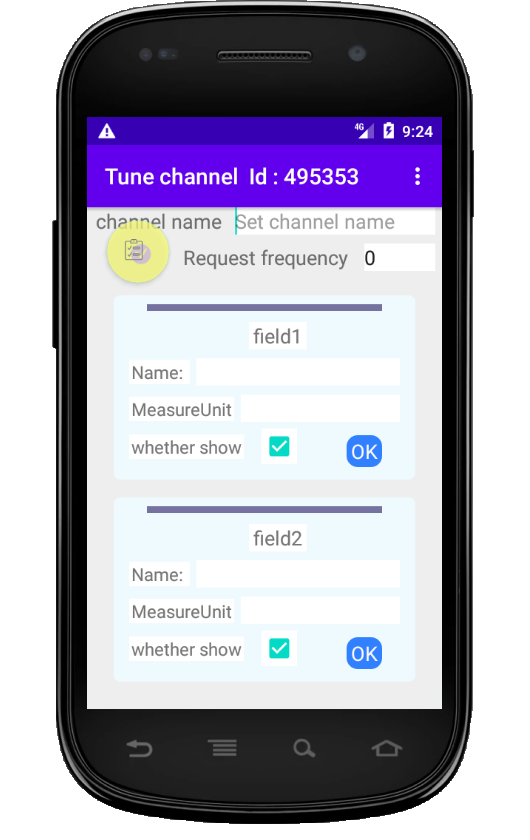
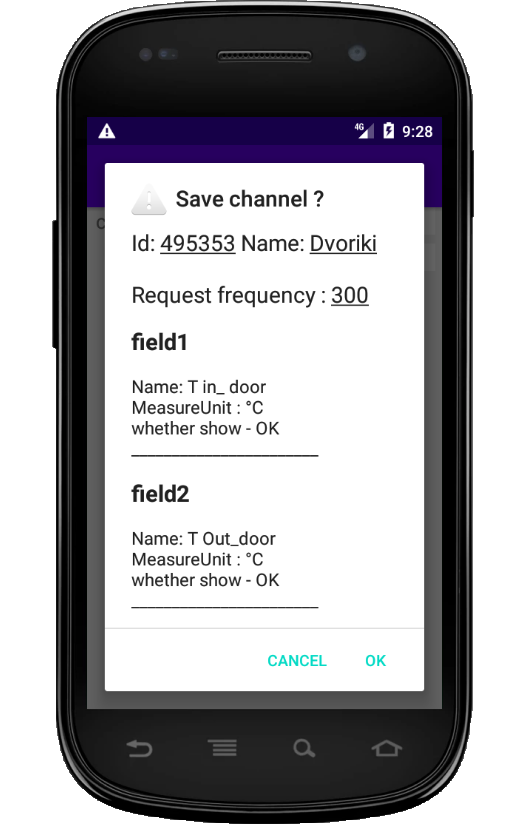

# SimpleTSViewer

Simple, very simple! It is viewer for thingspeak channels.
Properties:
    -_Support only open channels_.
    -Support show many channels, however show at one time only one channel.
    -Tune fields from channel for show( can be set field name, it measure unit, user choose fields to show)
    -May set autoupdate mode

1. Add channel
    -On first start app the addChannel confirm be showed
    |    |    |  |   |
    |:---|:-----|:---|:---|
    | | Menu item "Add channel" visible only on channels screen.  First action: *menu -> channels*,  second : *menu -> Add channel*.  After press on "Add channel" must be add channel confirm  |  | Enter channel ID  **Work only open channel**  it is value of Channel ID on top channel screen Thingspeak site|
    | | There  you must fill channel properties. All Properties is no need to save? *In this case all fields be empty*.  1. Name - label on top screen for this channel 2. request frequency - you may define it by need autoupdate channel data.  Field properties consist from  1. Field name - it be set for labeled value this field.  2.Measure unit - be show after field value Checkbox "whether show" if not checked - field cannot be showed on channel values screen ok button - press on it may be mandatory. If not pressed - changes cannot set.   After fill must press on button on top screen / It leave to confirm to save/ See next picture.  | | |